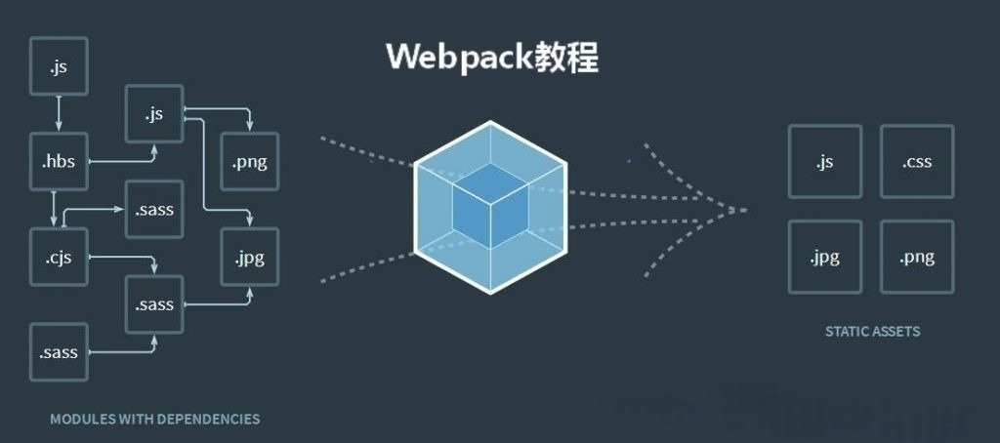

# Webpack

[仓库地址](https://github.com/xvlincaigou/webpack-tutorial)

## Webpack 简介

大家好，由我来为大家讲解 Webpack 的入门知识。

我们的主要内容是快速掌握 Webpack 的基础知识，知道它是做什么的，并学会最简单的使用方法。我们还会自己完成一个简单的 Webpack。

Q1：什么是 webpack？

A1：Webpack 是一个模块打包工具(module bundler)。


> At its core, webpack is a static module bundler for modern JavaScript applications.[^1] When webpack processes your application, it internally builds a dependency graph from one or more entry points and then combines every module your project needs into one or more bundles, which are static assets to serve your content from.[^2]

[^1]：这里的 static 的意思是，webpack 在构建时而不是运行时进行模块解析和打包。
[^2]：这里的 entry points 指的是指的是应用程序的起始模块。Webpack 从这些入口点开始构建依赖关系图，递归地解析和打包所有依赖的模块。入口点通常是应用程序的主文件，例如 index.js 或 main.js。

Q2：什么是模块？

A2：简单地理解，Webpack 认为一切都是模块，一个.js 文件、一个图片文件、一个.css 文件都是一个模块。

> In modular programming, developers break programs up into discrete chunks of functionality called a module.
> Each module has a smaller surface area than a full program, making verification, debugging, and testing trivial. Well-written modules provide solid abstractions and encapsulation boundaries, so that each module has a coherent design and a clear purpose within the overall application.
> Node.js has supported modular programming almost since its inception. On the web, however, support for modules has been slow to arrive. Multiple tools exist that support modular JavaScript on the web, with a variety of benefits and limitations. Webpack builds on lessons learned from these systems and applies the concept of modules to any file in your project.

Q3：什么是模块打包？

A3：模块打包，通俗地说就是：找出模块之间的依赖关系，按照一定的规则把这些模块组织合并为一个 JavaScript 文件，这是 Webpack 最本质的工作。
当然，我们可能并不想要它把这些合并成一个 JS 文件，这个时候我们可以通过一些规则或工具来改变它。

Q4：为什么要进行模块打包？

A4：在现代 Web 开发中，我们之所以需要对代码进行打包，主要是因为以下几个原因：

1. **模块化管理**：

   - 为了便于开发，我们需要使用模块化来开发，但是有的比较老旧的浏览器并不直接理解模块化的概念，因此需要将这些模块组合成一个或多个文件，以便浏览器可以正确加载和执行。

2. **资源优化**：

   - 打包工具可以帮助压缩和优化资源，如移除空白和注释、合并样式表和脚本文件，从而减小文件大小，加快页面加载速度。
   - 每次浏览器加载一个文件都需要进行一次 http 请求，这会带来网络上的额外开销。变成一个文件之后额外开销就小很多了。

3. **依赖管理**：

   - 打包工具可以自动处理模块间的依赖关系，确保正确的加载顺序，并避免因缺少依赖而导致的运行时错误。
   - 它还可以帮助处理异步加载和按需加载的需求，从而实现懒加载功能，提升用户体验。

Q5：我们之前学习的 React 中是否应用到了 webpack？

A5：是的，在 React 项目中，当你运行 npm run build 或类似的命令时，这些命令会执行项目中的构建脚本，而这些脚本通常会使用 Webpack 作为模块打包工具。
[点击此处打开新世界](https://stackoverflow.com/questions/43830866/what-is-npm-run-build-in-create-react-app)

## webpack 使用

### demo1

##### 初始化

```shell
mkdir demo1
cd demo1
npm init -y
```

npm init -y 用于快速初始化一个新的项目。这个命令会自动生成一个 package.json 文件，该文件包含了项目的基本信息。使用-y 或--yes 选项会让 npm init 使用默认值自动填充 package.json 文件的内容。后续可以根据需要编辑 package.json 文件来添加或修改项目信息。

```javascript
//a.js
import { name } from "./b.js";
console.log(name);
```

```javascript
//b.js
export const name = "Mamba";
```

```html
<!-- index.html -->
<!DOCTYPE html>
<html lang="en">
  <head>
    <meta charset="UTF-8" />
    <title>Document</title>
    <script src="./a.js"></script>
  </head>
  <body></body>
</html>
```

##### 第一次出错

"Uncaught SyntaxError: Cannot use import statement outside a module."

你提供的 JavaScript 代码在一个不支持 ES 模块的环境中执行!

为了使用 `import` 语句，你需要确保你的 JavaScript 文件被视为模块。而在浏览器环境中，默认情况下一个.js 文件被视为一个普通的脚本而不是模块。

我们如何解决这个问题？

1. 在导入 JavaScript 文件的 HTML `<script>` 标签中添加 `type="module"` 属性。（由于浏览器的同源策略，在我们这个案例当中，你还需要下载 vscode 的 live-server 插件，用这个插件打开 index.html）
2. 使用 Webpack ，将你的全部 JavaScript 文件打包成可以在浏览器环境中执行的单个文件。

##### 安装 webpack 和 webpack-cli

```shell
npm install --save-dev webpack webpack-cli
```

npm install --save-dev webpack webpack-cli，会在 Node.js 项目中安装两个包：webpack 和 webpack-cli，并将它们添加到项目的 package.json 文件中的 devDependencies 部分。

--save-dev: 这个选项指定安装的包将被添加到 package.json 文件的 devDependencies 部分。

webpack-cli: webpack-cli 是 webpack 的命令行接口工具，提供了一系列命令来管理 webpack 配置和项目的打包过程。

##### 执行 webpack

```shell
npx webpack ./a.js
```

npx webpack ./a.js 使用 npx 来执行 webpack 命令，以./a.js 作为入口文件进行打包。

npx: npx 允许你运行在本地 node_modules/.bin 目录或全局安装的 npm 包中的命令。使用 npx 的好处之一是，你可以运行项目中安装的包的命令，而不需要全局安装这些包。

./a.js: 这是 webpack 命令的参数，指定了打包的入口文件。webpack 将从 a.js 文件开始，分析依赖关系，然后打包这个文件以及它依赖的所有模块。在我们的这个 demo1 当中，由于 index.html 直接使用的是 a.js，并且 a.js 依赖于 b.js，所以我们要让 a.js 作为入口。

##### webpack 的配置文件

```javascript
const path = require("path");
module.exports = {
  entry: "./a.js",
  output: {
    path: path.resolve(__dirname, ""),
    filename: "bundle.js",
  },
  mode: "none",
};
```

> const path = require("path);

这行引入了 Node.js 的 path 模块，用于处理文件路径。

> module.exports = { ... };

这行代码导出一个对象，该对象定义了 Webpack 的配置。通过 module.exports 导出的配置，Webpack 在运行时会自动读取。

> entry: "./a.js",

entry 属性指定了 Webpack 打包的入口文件。在这个例子中，入口文件是当前目录下的 a.js。Webpack 会从这个文件开始，分析所有依赖的模块，并将它们打包。

> output: { ... }

output 属性定义了 Webpack 打包后的输出设置。
path: path.resolve(\_\_dirname, ""),：path 属性指定了输出文件的存放目录。path.resolve(\_\_dirname, "")使用 path 模块的 resolve 方法，将路径解析为绝对路径。在这里，它解析当前文件所在目录的绝对路径（\_\_dirname 是 Node.js 中的一个全局变量，表示当前执行脚本所在的目录）。
filename: "bundle.js",：filename 属性指定了输出文件的名称。在这个例子中，打包后的文件名为 bundle.js。

> mode: "none",

mode 属性指定了 Webpack 的模式。Webpack 有三种模式：development（开发模式）、production（生产模式）和 none（无任何默认优化）。在这个例子中，模式被设置为 none，意味着不启用任何默认优化配置。

### demo2

```javascript
//a.js
import "./b.css";
```

```css
/*b.css*/
.hello {
  margin: 30px;
  color: blue;
}
```

```html
<!--index.html-->
<!DOCTYPE html>
<html lang="en">
  <head>
    <script src="./a.js"></script>
  </head>
  <body>
    <div class="hello">Hello, Loader</div>
  </body>
</html>
```

Webpack 在进行打包的时候，对所有引入的资源文件，都当作模块来处理。但 Webpack 自身不支持 CSS 文件或图片文件的处理。Webpack 在处理该模块的时候，会在控制台报错：

Module parse failed…You may need an appropriate loader to handle this file type.你需要你个合适的 loader 来处理该文件类型。

当 Webpack 自身无法处理某种类型的文件的时候，我们就可以通过配置特定的 loader，赋予 Webpack 来处理该类型文件的能力。

##### 安装 css-loader 和 style-loader

```shell
npm install --save-dev css-loader style-loader
```

##### webpack.config.js 里配置上这两个 loader

```javascript
const path = require("path");
module.exports = {
  entry: "./a.js",
  output: {
    path: path.resolve(__dirname, ""),
    filename: "bundle.js",
  },
  module: {
    rules: [
      {
        test: /\.css$/,
        use: ["style-loader", "css-loader"],
      },
    ],
  },
  mode: "none",
};
```

可以看到，我们需要对配置项新增 module，该项是一个对象，其 rules 里是我们对各个类型文件的处理规则配置。

test 值是一个正则表达式，表示当文件名后缀是.css 的时候，我们使用对应 use 项里的 loader。

use 值是一个数组，每一项是一个 loader。loader 的执行顺序是从后向前执行，先执行 css-loader，然后把 css-loader 执行的结果交给 style-loader 执行。

现在我们执行 npx webpack 来完成打包，然后在浏览器打开 index.html，发现 CSS 生效了，文字颜色变成蓝色。

## mytoywebpack

要实现一个简易的 webpack，有三个主要步骤：

1. 解析一个文件并提取它的依赖项。
2. 递归地提取依赖并生成依赖关系图。
3. 将所有被依赖的模块打包进一个文件。

### 准备 src

### 解析一个文件并提取其依赖关系

把文件内容解析成字符串，然后用正则语言找到`import`和`export`语句（？）

我们不应该重复造轮子！

`@babel/parser` 是 `Babel` 的一部分，用于将 JavaScript 代码解析成抽象语法树（AST）。这对于代码转换、静态分析等任务非常有用。

```shell
npm install --save-dev @babel/parser
```

```javascript
// 引入 @babel/parser 模块，用于将 JavaScript 代码解析成抽象语法树（AST）
const parser = require("@babel/parser");
// 引入 fs 模块，用于文件系统操作，如读取文件
const fs = require("fs");

/**
 * 获取JS源文件的抽象语法树（AST）
 * @param {String} filename 文件名称，包括路径
 * @returns {Object} 返回文件内容解析后的抽象语法树（AST）
 */
function getAST(filename) {
  // 使用 fs.readFileSync 方法同步读取文件内容，返回文件内容字符串
  // 第一个参数是文件路径，第二个参数是文件编码，这里使用 "utf-8" 编码
  const content = fs.readFileSync(filename, "utf-8");

  // 使用 @babel/parser 的 parse 方法将文件内容字符串解析成 AST
  // 第一个参数是要解析的代码字符串，第二个参数是解析选项
  // 这里的选项是 sourceType: "module"，表示解析的代码是 ES 模块
  const ast = parser.parse(content, {
    sourceType: "module",
  });

  console.log(ast);
  return ast;
}

// 调用 getAST 函数，传入要解析的文件路径，这里是 "./src/entry.js"
// 这行代码实际执行了 AST 的获取过程
getAST("./src/entry.js");
```

```shell
node ./bundler.js
```

[AST 在线解析](https://astexplorer.net/)

[更加详细的解读](https://dev.to/marvinjude/abstract-syntax-trees-and-practical-applications-in-javascript-4a3)

### 递归解析依赖

生成抽象语法树后，便可以去查找代码中的依赖，我们可以自己写查询方法递归的去查找，也可以使用 `@babel/traverse` 进行查询，`@babel/traverse` 模块维护整个树的状态，并负责替换，删除和添加节点。

```shell
npm install --save-dev @babel/traverse
```

```javascript
const traverse = require("@babel/traverse").default;

/**
 * 从 AST 中提取所有的 import 声明
 * @param {Object} ast 抽象语法树（AST）
 * @returns {Array} 返回一个包含所有 import 源值的数组
 */
function getImports(ast) {
  // 初始化一个空数组，用于存储所有的 import 源值
  const imports = [];
  // 使用 traverse 函数遍历 AST
  traverse(ast, {
    // 当遍历到 ImportDeclaration 节点时执行的函数
    ImportDeclaration: ({ node }) => {
      // 将当前 import 声明的源值添加到 imports 数组中
      imports.push(node.source.value);
    },
  });
  console.log(imports);
  return imports;
}

// 初始化一个全局变量 ID，用于给每个 asset 分配一个唯一的 ID
let ID = 0;

/**
 * 获取文件的 asset 对象
 * @param {String} filename 文件名，包括路径
 * @returns {Object} 返回一个包含 id, filename, dependencies 的对象
 */
function getAsset(filename) {
  // 使用 getAST 函数获取文件的 AST
  const ast = getAST(filename);
  // 使用 getImports 函数获取文件的所有依赖
  const dependencies = getImports(ast);
  // 为当前文件分配一个唯一的 ID，并自增 ID 值
  const id = ID++;
  // 返回一个包含 id, filename, dependencies 的对象
  return {
    id,
    filename,
    dependencies,
  };
}

// 获取入口文件 "./src/entry.js" 的 asset 对象
const mainAsset = getAsset("./src/entry.js");
console.log(mainAsset);
```

### 生成依赖关系图

然后，我们需要写一个方法生成依赖关系图，该方法应该接受入口文件路径作为参数，并返回一个包含所有依赖关系的数组。这里使用队列，原理是不断遍历队列中的 asset 对象，如果 asset 对象的 dependencies 不为空，则继续为每个 dependency 生成 asset 并加入队列，并为每个 asset 增加 mapping 属性，记录依赖之间的关系。持续这一过程直到 queue 中的元素被完全遍历。具体实现如下：

```javascript
/**
 * 生成依赖关系图
 * @param {String} entry 入口文件路径
 * @returns {Array} 返回一个包含所有依赖关系的数组
 */
function createGraph(entry) {
  // 使用 getAsset 函数获取入口文件的 asset 对象
  const mainAsset = getAsset(entry);
  // 初始化一个队列，并将入口文件的 asset 对象作为第一个元素
  const queue = [mainAsset];

  // 遍历队列中的每个 asset 对象
  for (const asset of queue) {
    // 获取当前 asset 文件所在目录的路径
    const dirname = path.dirname(asset.filename);
    // 初始化当前 asset 对象的 mapping 属性，用于记录依赖关系
    asset.mapping = {};

    // 遍历当前 asset 对象的 dependencies 数组
    asset.dependencies.forEach((relPath, index) => {
      // 将相对路径转换为绝对路径
      const absPath = path.join(dirname, relPath);
      // 使用 getAsset 函数获取依赖文件的 asset 对象
      const child = getAsset(absPath);
      // 在当前 asset 对象的 mapping 中记录依赖文件的路径和其对应的 id
      asset.mapping[relPath] = child.id;
      // 将依赖文件的 asset 对象加入队列，以便后续遍历
      queue.push(child);
    });
  }

  // 遍历完成后，返回包含所有依赖关系的队列
  return queue;
}
```

### 打包

```shell
npm install @babel/preset-env --save-dev
```

```javascript
function getAsset(filename) {
  // 使用 getAST 函数获取文件的 AST
  const ast = getAST(filename);
  // 使用 getImports 函数获取文件的所有依赖
  const dependencies = getImports(ast);
  // 为当前文件分配一个唯一的 ID，并自增 ID 值
  const id = ID++;
  // 编译
  // 使用 babel.transformFromAstSync 方法将 AST 转换为兼容的 JavaScript 代码
  // 第一个参数是 AST，第二个参数是源代码（这里不需要，故为 null）
  // 第三个参数是转换选项，这里指定使用 "@babel/env" 预设
  const { code } = babel.transformFromAstSync(ast, null, {
    presets: ["@babel/env"],
  });
  // 返回一个包含 id, filename, dependencies, 以及转换后的代码 code 的对象
  return {
    id,
    filename,
    dependencies,
    code,
  };
}
```

```javascript
/**
 * 打包函数，将依赖关系图转换为可执行的 JavaScript 代码
 * @param {Array} graph 依赖关系图，包含所有模块的信息
 */
function bundle(graph) {
  // 初始化 modules 字符串，用于构建模块定义的部分
  let modules = "";

  // 遍历依赖关系图中的每个模块
  graph.forEach((mod) => {
    // 为每个模块构建一个模块定义，并追加到 modules 字符串中
    // 模块定义包括模块 ID、模块代码和模块依赖的映射关系
    modules += `${mod.id}:[
      function (require, module, exports) { ${mod.code}},
      ${JSON.stringify(mod.mapping)}
    ],`;
  });

  // 构建最终的打包代码，使用立即执行函数表达式 (IIFE) 封装模块定义
  const bundledCode = `
    (function (modules) {
      // 定义 require 函数，用于加载模块
      function require(id) {
        // 通过模块 ID 获取模块定义，包括模块函数和映射关系
        const [fn, mapping] = modules[id];

        // 定义 localRequire 函数，用于处理模块内部的 require 调用
        function localRequire(relPath) {
          // 通过相对路径获取模块 ID，并调用全局的 require 函数
          return require(mapping[relPath]);
        }

        // 创建一个模块对象，用于模块函数填充 exports
        const localModule = { exports : {} };
        
        // 执行模块函数，传入 localRequire、模块对象和 exports
        fn(localRequire, localModule, localModule.exports);

        // 返回模块的 exports 对象
        return localModule.exports;
      }

      // 从入口模块（ID 为 0）开始执行
      require(0);

    })({${modules}})
  `;
  // 将打包后的代码写入到 "./main.js" 文件中
  fs.writeFileSync("./main.js", bundledCode);
}
```

这段代码定义了一个 bundle 函数，它接收一个依赖关系图作为参数。该函数首先遍历依赖关系图中的每个模块，为每个模块构建一个模块定义，并将这些定义聚合成一个字符串。然后，使用一个立即执行函数表达式（IIFE）来封装这些模块定义，并在其中定义一个 require 函数用于模块加载。require 函数能够根据模块 ID 加载相应的模块，并处理模块间的依赖关系。最后，这段打包后的代码被写入到一个文件中，通常是作为打包后的应用程序的入口点。
